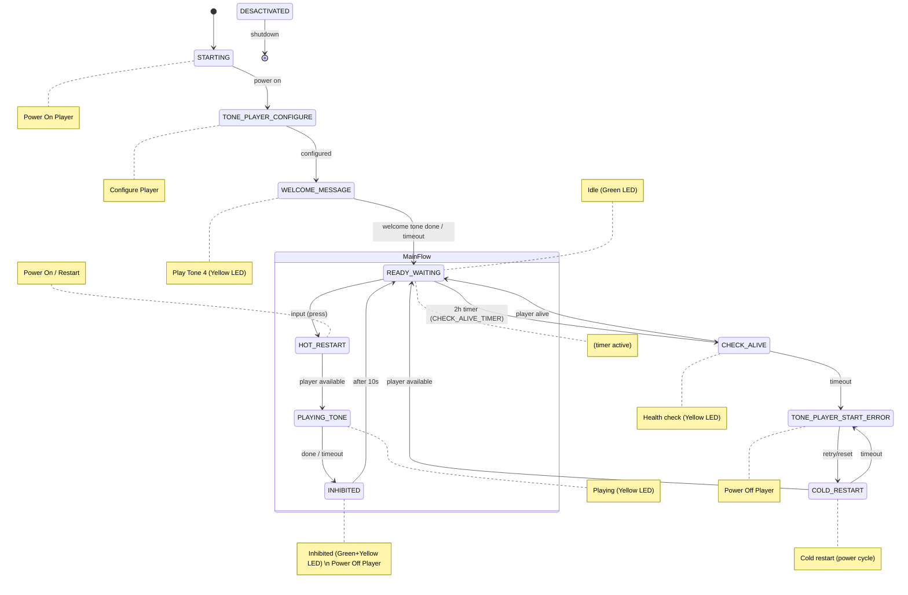

# State Machine Diagram

```mermaid
stateDiagram-v2
  direction TB

  %% Startup
  [*] --> STARTING
  STARTING --> TONE_PLAYER_CONFIGURE: power on
  note right of STARTING: Power On Player

  TONE_PLAYER_CONFIGURE --> WELCOME_MESSAGE: configured
  note right of TONE_PLAYER_CONFIGURE: Configure Player

  WELCOME_MESSAGE --> READY_WAITING: welcome tone done / timeout
  note right of WELCOME_MESSAGE: Play Tone 4 (Yellow LED)

  %% Main vertical flow (primary column)
  state MainFlow {
    direction TB
    READY_WAITING --> HOT_RESTART: input (press)
    note left of READY_WAITING: Idle (Green LED)

    HOT_RESTART --> PLAYING_TONE: player available
    note left of HOT_RESTART: Power On / Restart

    PLAYING_TONE --> INHIBITED: done / timeout
    note right of PLAYING_TONE: Playing (Yellow LED)

    INHIBITED --> READY_WAITING: after 10s
    note right of INHIBITED: Inhibited (Green+Yellow LED) \n Power Off Player
  }

  %% Side flows
  READY_WAITING --> CHECK_ALIVE: 2h timer (CHECK_ALIVE_TIMER)
  note right of READY_WAITING: (timer active)

  CHECK_ALIVE --> READY_WAITING: player alive
  CHECK_ALIVE --> TONE_PLAYER_START_ERROR: timeout
  note right of CHECK_ALIVE: Health check (Yellow LED)

  TONE_PLAYER_START_ERROR --> COLD_RESTART: retry/reset
  note right of TONE_PLAYER_START_ERROR: Power Off Player

  COLD_RESTART --> READY_WAITING: player available
  COLD_RESTART --> TONE_PLAYER_START_ERROR: timeout
  note right of COLD_RESTART: Cold restart (power cycle)

  DESACTIVATED --> [*]: shutdown
```