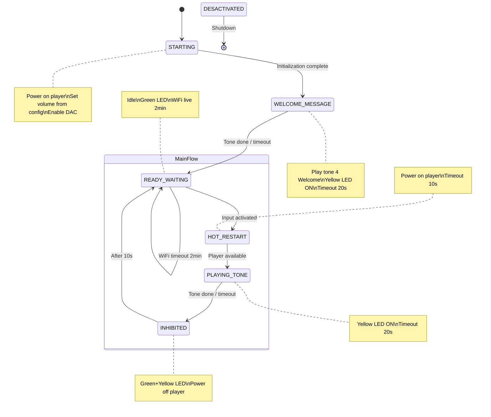

# State Machine Diagram

```mermaid
stateDiagram-v2
    direction TB

    %% Startup phase
    [*] --> STARTING
    STARTING --> WELCOME_MESSAGE: Initialization complete
    note right of STARTING: Power on player\nSet volume from config\nEnable DAC

    WELCOME_MESSAGE --> READY_WAITING: Tone done / timeout
    note right of WELCOME_MESSAGE: Play tone 4 Welcome\nYellow LED ON\nTimeout 20s

    %% Main vertical flow (center column)
    state MainFlow {
        direction TB

        READY_WAITING --> HOT_RESTART: Input activated
        note left of READY_WAITING: Idle\nGreen LED\nWiFi live 2min

        HOT_RESTART --> PLAYING_TONE: Player available
        note left of HOT_RESTART: Power on player\nTimeout 10s

        PLAYING_TONE --> INHIBITED: Tone done / timeout
        note right of PLAYING_TONE: Yellow LED ON\nTimeout 20s

        INHIBITED --> READY_WAITING: After 10s
        note right of INHIBITED: Green+Yellow LED\nPower off player
    }

    %% WiFi management (outside main flow)
    READY_WAITING --> READY_WAITING: WiFi timeout 2min
    
    %% Terminal state
    DESACTIVATED --> [*]: Shutdown
```